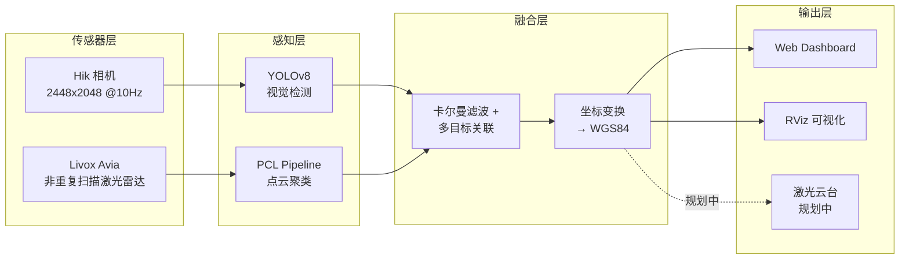

# 禁飞区无人机识别与激光引导系统 · 项目中期报告

> 作者：guichen  
> 日期：2026-05-02  
> 版本：v0.1（中期）

---

## 一、项目简介

### 1.1 项目定位

本项目面向**禁飞区域（机场周界、监狱、政府机要区、大型活动安保等）的低空无人机入侵防范**，构建一套以**地面侧雷达 + 摄像头双模态融合感知**为核心、并以**激光定向引导/反制**作为执行末端的一体化系统。

> 一句话概括：**地面雷达识别 + 视觉确认 + 多目标融合跟踪 + 激光定向反制**。

### 1.2 应用场景

- 民航机场周界反"黑飞"
- 监狱、看守所禁运物品防投递
- 政府机要、军事敏感区域空域防御
- 大型活动（演唱会、体育赛事）应急安保
- 重要基础设施（变电站、油库、核电站）周界

### 1.3 关键能力概览

- **实时感知**：10 Hz 端到端，覆盖典型 100m × 100m 监控空域
- **双模态融合**：雷达提供精确 3D 位置 + 摄像头提供语义类别 + 置信度
- **多目标跟踪**：基于卡尔曼滤波的稳定 ID 跟踪 + 漏帧容忍
- **WGS84 经纬度定位**：直接输出真实地理坐标，便于上层调度
- **Web 远程监控**：浏览器即可查看实时画面、地图、报警，无需安装客户端
- **全栈仿真**：无需任何硬件即可在 Gazebo 中演示完整链路

### 1.4 系统架构



主要 ROS 2 topic 流向：

```
/hik_camera/image_raw  ──► yolo_detector  ──► /camera/detect_result ─┐
                                                                      ├─► fusion_manager ──► /fusion/final_result ──► web_dashboard
/livox/lidar           ──► radar_processor ──► /radar/detect ────────┘                  └► /fusion/markers      ──► RViz
                                              /radar/dynamic_cloud ─────────────────────────────────────────────► RViz
```

---

## 二、所用技术（详细）

本系统是一个**多包 ROS 2 工作区**，按层次组织成 **传感器驱动 / 感知 / 融合 / 可视化 / 仿真 / 前端** 六大子系统，下面分块介绍。

### 2.1 系统层（System）

| 项 | 内容 |
|----|------|
| 操作系统 | Ubuntu 22.04 LTS |
| 中间件 | **ROS 2 Humble**（DDS 通信、生命周期管理） |
| 构建系统 | colcon + ament_cmake (C++) / ament_python (Python) |
| 自定义消息包 | `interface`：定义 `DroneDetect`（含像素 bbox、3D 位置、置信度、ID）和 `DroneDetectArray` |
| 进程管理 | ROS 2 Launch + `TimerAction` 编排启动顺序，避免节点竞态 |

### 2.2 视觉感知（Vision Perception）

- **YOLOv8 自训练**
  - 框架：[Ultralytics 8.4](https://docs.ultralytics.com/)
  - 数据集：自标注无人机数据集（约 X 张图，DJI/自由曲面四旋翼为主）
  - 模型导出：同时保留 `.pt` 和 `.onnx`，工作流自动优先使用 `.pt`
  - 默认置信度阈值 `conf_thresh = 0.25`，仿真场景下保证召回
- **跨 Python 版本桥接（关键工程亮点）**
  - 系统 Python 3.10 + OpenCV 4.5.4 解析 YOLOv8 ONNX 时**触发 `total()` 断言崩溃**（已尝试 opset 11/12/17 均失败）
  - 解决方案：让 ROS 节点继续跑系统 Python（`yolo_node.py`），通过 `subprocess` 调起 conda 环境的 Python 3.8 + cv2 4.13 + ultralytics 8.4 跑实际推理（`yolo_worker.py`）
  - 通信协议：**二进制 stdio**，4 字节 BE uint32 长度 + JPEG 帧（图像）/ JSON 帧（结果），单线程 serial 同步
  - fd 重定向技巧：`os.dup(1)` 保留干净的 IPC channel，再 `os.dup2(2,1)` 把 fd=1 重指向 stderr，避免任何库的 `print` 污染二进制协议
- **图像处理**：cv_bridge 做 `sensor_msgs/Image` ↔ OpenCV BGR8 转换；传输前 JPEG 压缩（quality=85）降带宽

涉及文件：
- [src/simulation/simulation/yolo_node.py](../src/simulation/simulation/yolo_node.py) — ROS 节点 + IPC 主控
- [src/simulation/simulation/yolo_worker.py](../src/simulation/simulation/yolo_worker.py) — conda 环境推理 worker

### 2.3 雷达感知（Radar Perception）

基于 PCL（Point Cloud Library）实现完整的点云处理流水线：

| 步骤 | 算法 | 关键参数 | 作用 |
|------|------|---------|------|
| 1 | **VoxelGrid** | `voxel_size=0.10m` | 降采样，减少点数 |
| 2 | **CropBox** | ROI ±100m × ±100m × 1–50m | 裁掉监控范围外的杂点 |
| 3 | **GICP** 配准 | `max_iter=50` | 与预建地图配准（占位，待完整实现差分） |
| 4 | **StatisticalOutlierRemoval** | `mean_k=5, stddev=2.0`（仿真）/ `30, 1.0`（真实） | 滤除离散噪点，仿真稀疏点云已做单点放行 |
| 5 | **EuclideanClusterExtraction** | `tolerance=1.5m, min_size=3` | 把点聚成候选团簇 |
| 6 | **尺寸/高度过滤** | 高度 ∈ [3,50]m，长宽 ≤ 6m | 排除地面物 / 大型物体 |

输出：`DroneDetectArray`（含 3D centroid、bbox 尺寸、点数）+ 高亮 intensity 点云 + 候选 mesh marker。

涉及文件：
- [src/radar/src/radar_processor.cpp](../src/radar/src/radar_processor.cpp)
- [src/radar/include/radar/radar_processor.hpp](../src/radar/include/radar/radar_processor.hpp)

### 2.4 数据融合（Sensor Fusion）

- **卡尔曼滤波多目标跟踪（Kalman Filter MOT）**
  - 状态向量：`[x, y, z, vx, vy, vz]`（位置 + 速度）
  - 状态转移：恒速模型 + 过程噪声
  - 观测模型：雷达提供 3D 位置 / 摄像头提供 2D 投影
- **数据关联（Data Association）**
  - 三重匹配代价：
    1. **3D 距离**（雷达 ↔ 雷达 / 跟踪态 ↔ 雷达观测）
    2. **像素距离**（视觉 bbox 中心点 ↔ 跟踪态投影）
    3. **IoU**（视觉 bbox ↔ 跟踪态 bbox 投影）
  - 匹配阈值参数化：`match_dist_thresh=300px`、`match_iou_thresh=0.01`（仿真放宽）
- **生命周期**
  - `confirm_thresh=2`：连续命中 2 帧才确认为有效目标
  - `max_miss_frames=10`：允许漏 10 帧后再删除轨迹
- **置信度融合**
  - 雷达观测：固定 0.6
  - 视觉观测：YOLO conf 直传
  - 融合后取加权或最大值（视配置）

涉及文件：
- [src/fusion/src/fusion_manager.cpp](../src/fusion/src/fusion_manager.cpp)（融合主控）
- [config/sim_params.yaml](../config/sim_params.yaml)（融合参数集中配置）

### 2.5 坐标变换（Coordinate Transformations）

本系统涉及 4 种坐标系：

```
雷达系 (lidar)                相机系 (camera)            像素系 (image)        WGS84
x=前 / y=左 / z=上    →    z=前 / x=右 / y=下    →    u=列 / v=行       →   lat / lng / alt
```

- **雷达→相机**：4×4 外参矩阵 `T_cam_lidar`（在 [config/sim_calib.yaml](../config/sim_calib.yaml) 中以 row-major 数组存储）
  ```
  x_cam = -y_lid,  y_cam = -z_lid,  z_cam = x_lid
  ```
- **相机→像素**：标准内参 `K = [[fx,0,cx],[0,fy,cy],[0,0,1]]`（仿真为 fx=fy=1000, cx=1224, cy=1024）
- **雷达→WGS84**：以传感器位置为原点，做局部平面投影（赤道周长近似）
  ```
  lat = origin_lat + (x / R_earth) * 180/π
  lng = origin_lng + (y / R_earth / cos(origin_lat)) * 180/π
  ```
- **传感器位姿**：用户在 Web UI 上拖拽设置（类 RViz 2D Pose Estimate），通过 socket.io 实时同步到 fusion 节点

### 2.6 仿真（Simulation）

整套系统在不接任何硬件时也能跑通完整链路，通过 **Gazebo Classic 11** 模拟传感器：

| 模拟对象 | 插件 | 配置 |
|----------|------|------|
| 摄像头 | `libgazebo_ros_camera.so` | 10Hz、2448×2048、`hfov=1.8847rad` 严格匹配 K 矩阵 |
| 雷达 | `libgazebo_ros_ray_sensor.so` | 360 horiz × 128 vert，±60° / ±35°，200m 量程 |
| 状态控制 | `libgazebo_ros_state.so` | 暴露 `/gazebo/set_entity_state` 服务 |

**仿真特殊处理**：
- 无人机模型用真实 quadrotor `.dae` mesh（OSRF gazebo_models 衍生）+ 4× 缩放，便于远距离 YOLO 识别
- collision box 1.5m 高，让稀疏雷达射线能多打到几层（避免点云只有一条横线）
- `sim_bridge` 用 `SetEntityState` 服务驱动无人机沿圆周飞行（半径 50m，高度 8m，周期 40s）
- 启动顺序：gzserver → 5s → 感知 → 6s → web → 7s → RViz → 8s → sim_bridge

涉及文件：
- [src/simulation/launch/sim_launch.py](../src/simulation/launch/sim_launch.py)
- [src/simulation/worlds/drone_sim.world](../src/simulation/worlds/drone_sim.world)
- [src/simulation/simulation/sim_bridge.py](../src/simulation/simulation/sim_bridge.py)

### 2.7 前端 Web Dashboard

| 项 | 选型 |
|----|------|
| 后端 | **Flask + Flask-SocketIO**（threading 模式，`allow_unsafe_werkzeug=True`） |
| 前端 | 原生 JS + Leaflet 1.9 |
| 地图瓦片 | OpenStreetMap |
| 地点搜索 | Nominatim（无需 API Key） |
| 实时通信 | WebSocket（drone_update / drone_warn / camera_frame / sensor_pose_current 等事件） |

**自研交互亮点**：
- 类似 RViz 的 **2D Pose Estimate** 拖拽设置传感器位姿（按下 → 拖出箭头方向 → 松开确认）
- **Pose-Gating**：未设置位姿时弹出引导框 + 顶部按钮脉动闪烁，且不显示无人机；用户必须先设置才能看到实时轨迹
- 高度色标 / 报警弹窗 / 实时 YOLO 标注画面 / 检测目标列表

涉及文件：
- [src/web_dashboard/web_dashboard/app.py](../src/web_dashboard/web_dashboard/app.py)
- [src/web_dashboard/templates/index.html](../src/web_dashboard/templates/index.html)

### 2.8 RViz 可视化

- 与 Gazebo **同款** quadrotor mesh（保证两侧视觉一致）
- 雷达 `dynamic_cloud` 用 intensity 通道高亮候选无人机点（值=250 鲜亮）
- 候选目标用**半透明淡青色无人机 mesh**叠在点云上，避免红色立方体的"假"感
- 自定义 RViz 配置 [config/sim_rviz.rviz](../config/sim_rviz.rviz) 一键加载

---

## 三、现有成果（详细）

### 3.1 端到端链路全部跑通 ✅

| 链路 | 起点 | 终点 | 实测帧率 | 状态 |
|------|------|------|---------|------|
| 视觉链路 | `/hik_camera/image_raw` | `/fusion/final_result` → Web | ~9 fps | ✅ 通 |
| 雷达链路 | `/livox/lidar` | `/fusion/final_result` → Web | ~10 fps | ✅ 通 |
| 融合链路 | 视觉 + 雷达 | WGS84 经纬度 + Web 弹窗 | ~10 fps | ✅ 通 |
| 报警链路 | 高置信度目标 | `/fusion/warn_json` → 前端 toast | 触发即推 | ✅ 通 |

### 3.2 Gazebo 全栈仿真演示 ✅

- **单条命令启动全部节点**：`ros2 launch simulation sim_launch.py gui:=true`
- 包含 Gazebo gzserver/gzclient + sim_bridge + yolo_node（含 conda 子进程）+ radar_node + fusion_manager + web_dashboard + RViz + 静态 TF
- 无任何硬件依赖，**适合实验室演示和招标 / 评审展示**

### 3.3 Web 仪表盘功能完整 ✅

- 🗺️ **实时地图**：OpenStreetMap 底图 + 高度色标无人机标记 + 弹窗显示 X/Y/高度/速度/置信度
- 🎯 **目标列表**：右侧面板，每个目标一张卡片，含 ID / 高度 / 置信度 / 速度 / 类别
- 📷 **实时画面**：YOLO 标注后的相机画面（绿色 bbox）
- ⚠ **报警弹窗**：HIGH/MID/LOW 三级报警，自动 8s 消失
- 📍 **拖拽式传感器位姿**：类 RViz 2D Pose Estimate，确认后显示橙色圆点 + 蓝色箭头 + 角度标签
- 🚧 **位姿 gating**：未设置位姿时强制弹窗引导，确保用户使用流程闭环
- 🔍 **地点搜索**：Nominatim 关键字搜索，回车跳转

### 3.4 RViz 同步可视化 ✅

- Gazebo 的无人机和 RViz 的 marker 用同一个 `quadrotor.dae` mesh，**两端视觉完全一致**（不再是"灰色立方体"vs"花花世界"）
- 雷达点云中候选无人机点 intensity 通道置 250，配合 RViz 的 Intensity 着色器**自动高亮**
- 半透明淡青色无人机 mesh 标记叠在点云上，**视觉上即可看出"这是被检测到的无人机"**
- 三脚架 / 雷达 / 相机的传感器云台 marker 用正确的四元数旋转，腿与 Gazebo 一致

### 3.5 配置全外置化 ✅

- [config/sim_params.yaml](../config/sim_params.yaml)：fusion / yolo / radar / web 全部参数集中配置
- [config/sim_calib.yaml](../config/sim_calib.yaml)：相机内参 K + 雷达-相机外参 T_cam_lidar
- [config/sim_rviz.rviz](../config/sim_rviz.rviz)：RViz 显示项预设
- 所有节点通过 `--params-file` 注入，**不需要改一行代码即可切换场景**

### 3.6 工程稳健性（Engineering Robustness）✅

- **稀疏点云保护**：当 `cloud->size() < mean_k+2` 时自动跳过 SOR，避免 KDTree empty 触发 PCL 崩溃
- **跨 Python 版本进程隔离**：通过 conda subprocess 解决 OpenCV 4.5.4 ↔ YOLOv8 ONNX 不兼容问题，是本项目最具工程价值的设计之一
- **干净二进制 IPC**：fd dup + 重定向，确保任何库的 stdout 污染都不会破坏协议
- **启动顺序编排**：基于 `TimerAction` 的延时启动，配合 `wait_for_service` 双保险，杜绝节点初始化竞态
- **OGRE 黑屏修复**：在 launch 中显式 `OGRE_RTT_MODE=Copy`，解决 ros2 launch 子进程不继承渲染环境的问题

### 3.7 关键 bug 修复记录（精选）

| Bug | 现象 | 根因 | 解决方案 |
|-----|------|------|---------|
| YOLO 永远卡在第一帧 | worker 收到帧但无响应 | 库的 `print` 污染二进制 stdout | `os.dup(1)` 保留 IPC channel + `os.dup2(2,1)` 重定向 fd |
| Camera topic 双 namespace | `/hik_camera/hik_camera/image_raw` | plugin 同时设置 `<namespace>` 和 `<camera_name>` | 删 `<namespace>`，仅留 `<camera_name>` |
| sensor_unit 加载导致 gzserver 卡死 | 启动时长时间无响应 | 通过 `model://` 包含外部模型，引入网络 fetch | 把 sensor_unit 内联进 world 文件 |
| Gazebo 黑屏 | gzclient 渲染全黑 | 子进程不继承 `OGRE_RTT_MODE` | launch 中 `SetEnvironmentVariable` |
| Web 端口被占用 | 新 launch 后 web 没起来 | 上一次会话残留进程占 5000 | `lsof :5000` + kill |

### 3.8 当前性能与资源占用

> 测试平台：Ubuntu 22.04 + ROS 2 Humble + 无独立 GPU 仿真

| 节点 | CPU 占用 | 备注 |
|------|---------|------|
| gzserver | ~30% | 主要是 lidar 射线计算 |
| yolo_worker | ~80%（单核） | CPU only，可选装 onnxruntime-gpu |
| radar_processor | ~5% | PCL 流水线很轻 |
| fusion_manager | ~3% | 卡尔曼计算量小 |
| web_dashboard | ~2% | Flask + WebSocket |

---

## 四、不足与反思

### 4.1 系统层面

- ❌ **激光引导模块完全未实现**——这是项目核心目标之一的缺失，需要在下一阶段重点补齐
- ❌ **无可转云台**——当前传感器固定，覆盖角度受限于摄像头 FOV，目标飞出视野后即丢失
- ❌ **无 ROS bag 录制 / 回放标准流程**——每次调参都要重启 Gazebo，开发循环慢

### 4.2 算法层面

- ⚠ **YOLO 仿真识别率不稳定**：训练数据分布与 Gazebo 渲染存在域偏移（domain gap），需要将置信度阈值降到 0.25 才有稳定召回；未来需要补充仿真数据微调或域适应
- ⚠ **GICP 背景差分仅有占位**：当前 `gicpMapRegistration` 跑了配准但**没有实现差分提取动态点**，依赖后续聚类的尺寸/高度过滤来去背景，鲁棒性偏弱
- ⚠ **fusion 偶发产生重复 track**：当雷达和视觉对同一目标的观测距离较远时，匹配不上，会建出 2 条独立轨迹；需要进一步打磨匹配阈值或引入 Hungarian 算法
- ⚠ **经纬度转换精度**：当前用局部平面投影，距原点 1km 内误差 < 1m，但远距离会有几何畸变；如果需要扩展到大空域监控，需切换到 ECEF / UTM 坐标系

### 4.3 工程层面

- ❌ **无自动化测试**：所有验证靠人工跑 launch 看现象，回归风险高
- ❌ **Web 单机部署**：未考虑多用户并发、登录鉴权、HTTPS
- ❌ **无 CI/CD**：手动 colcon build，无质量门禁

---

## 五、下一步计划

按优先级和依赖关系排序：

### P0（本阶段重点）

1. **ROS bag 录制 / 回放工具链**
   - 完善 `scripts/record_bag.sh`，明确录制 `/hik_camera/image_raw` + `/livox/lidar` 两个原始 topic
   - 新增 `bag_launch.py` 跳过 Gazebo，直接接 bag 跑感知/融合/web
   - 用 `--clock` + `use_sim_time=true` 保证时间同步
   - **价值：摆脱 Gazebo 启动的 8-10 秒等待，调参循环从分钟降到秒级**

2. **可转云台集成**
   - 选型：DYNAMIXEL XL/XM 系列 / Pelco-D 协议商业云台 / 自研 STM32 + 步进电机
   - 接入 ROS 2 节点，提供 `/gimbal/cmd_pose` 话题接口
   - 仿真侧：sim_bridge 增加云台姿态输出，用 RViz 标记可视化

3. **跟踪闭环（Tracking）**
   - 订阅 `/fusion/final_result`，挑选最高优先级目标
   - 计算目标方位角和俯仰角 → 发布到云台
   - 加入死区 / 限速 / 平滑滤波，避免抖动

### P1（紧接在跟踪之后）

4. **激光指引模块**
   - 低功率瞄准激光器 → 高功率引导激光器（**注意法规审查**）
   - 与云台共光轴标定
   - 远距离瞄准精度的工程容差测试

5. **YOLO 模型迭代**
   - 收集真实场景数据（多机型、多光照、多背景）
   - 数据增强 + 重训练，目标：仿真和真实数据 mAP@0.5 > 0.85
   - 探索更轻量的模型（YOLOv8n / RT-DETR）以降低 CPU 占用

### P2（中后期）

6. **GICP 背景差分完整实现**
   - 加载预建场景点云地图
   - 配准后逐点最近邻距离阈值差分提取动态点
   - 替换当前的"靠尺寸/高度过滤去背景"策略

7. **多传感器布站**
   - 多组雷达 + 摄像头协同覆盖更大空域
   - 跨节点 ID 关联与全局坐标系融合

8. **测试体系建设**
   - 单元测试：坐标变换、卡尔曼数学、消息序列化
   - 集成测试：bag 回放冒烟测试
   - CI：colcon build + 测试自动化

### 时间预估（指示性）

| 阶段 | 任务 | 工期 |
|------|------|------|
| Sprint 1 | ROS bag 工具链 + 云台选型 + 接入 | 2 周 |
| Sprint 2 | 跟踪闭环 + 仿真验证 | 2 周 |
| Sprint 3 | 激光模块（低功率瞄准） + 实地试验 | 3 周 |
| Sprint 4 | YOLO 数据迭代 + GICP 差分 | 3 周 |
| Sprint 5 | 多传感器布站 + 测试体系 | 4 周 |

---

## 附录 A · 关键文件路径速查

| 类别 | 路径 |
|------|------|
| Launch | [src/simulation/launch/sim_launch.py](../src/simulation/launch/sim_launch.py) |
| 仿真世界 | [src/simulation/worlds/drone_sim.world](../src/simulation/worlds/drone_sim.world) |
| 仿真桥接 | [src/simulation/simulation/sim_bridge.py](../src/simulation/simulation/sim_bridge.py) |
| YOLO 节点 | [src/simulation/simulation/yolo_node.py](../src/simulation/simulation/yolo_node.py) |
| YOLO worker | [src/simulation/simulation/yolo_worker.py](../src/simulation/simulation/yolo_worker.py) |
| 雷达处理 | [src/radar/src/radar_processor.cpp](../src/radar/src/radar_processor.cpp) |
| 融合主控 | [src/fusion/src/fusion_manager.cpp](../src/fusion/src/fusion_manager.cpp) |
| Web 后端 | [src/web_dashboard/web_dashboard/app.py](../src/web_dashboard/web_dashboard/app.py) |
| Web 前端 | [src/web_dashboard/templates/index.html](../src/web_dashboard/templates/index.html) |
| 仿真参数 | [config/sim_params.yaml](../config/sim_params.yaml) |
| 标定文件 | [config/sim_calib.yaml](../config/sim_calib.yaml) |
| RViz 配置 | [config/sim_rviz.rviz](../config/sim_rviz.rviz) |

## 附录 B · 主要 ROS 2 Topic 一览

| Topic | 类型 | 发布者 | 订阅者 |
|-------|------|--------|--------|
| `/hik_camera/image_raw` | sensor_msgs/Image | gazebo camera plugin | yolo_detector |
| `/livox/lidar` | sensor_msgs/PointCloud2 | gazebo ray plugin | radar_processor |
| `/camera/detect_result` | interface/DroneDetectArray | yolo_detector | fusion_manager |
| `/camera/debug_image` | sensor_msgs/Image | yolo_detector | web_dashboard |
| `/radar/detect` | interface/DroneDetectArray | radar_processor | fusion_manager |
| `/radar/dynamic_cloud` | sensor_msgs/PointCloud2 | radar_processor | RViz |
| `/radar/cluster_markers` | visualization_msgs/MarkerArray | radar_processor | RViz |
| `/fusion/final_result` | interface/DroneDetectArray | fusion_manager | web_dashboard |
| `/fusion/warn_json` | std_msgs/String | fusion_manager | web_dashboard |
| `/fusion/markers` | visualization_msgs/MarkerArray | fusion_manager | RViz |
| `/sim/drone_visual` | visualization_msgs/MarkerArray | sim_bridge | RViz |
| `/sim/sensor_visual` | visualization_msgs/MarkerArray | sim_bridge | RViz |

---

> 本报告随项目迭代持续更新，下一次评审节点：**Sprint 2 末（约 4 周后）**。
